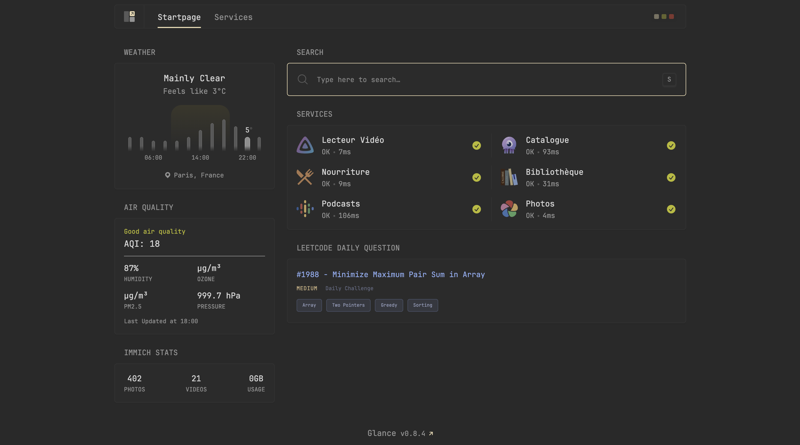
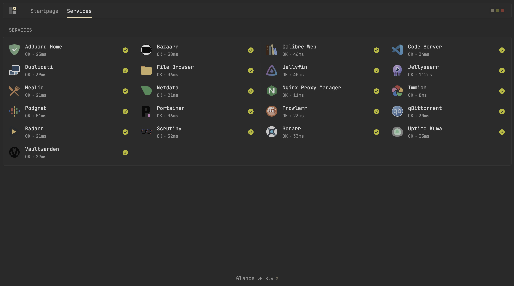
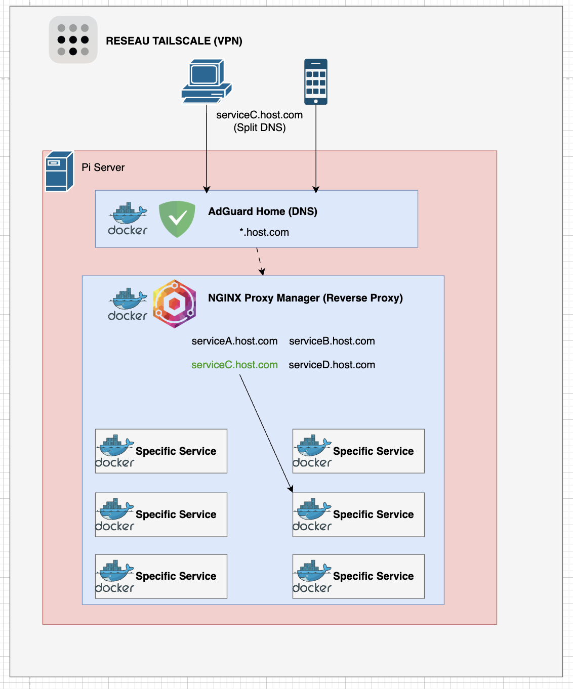

# Homelab

Stack Docker auto-hébergée composée de ~25 services organisés par catégorie.

## Prérequis

- Docker (version récente, Docker Compose v2 inclus)
- Git
- Un VPN WireGuard actif (requis pour qBittorrent via Gluetun)
- Un nom de domaine (optionnel, requis pour le mode web)
